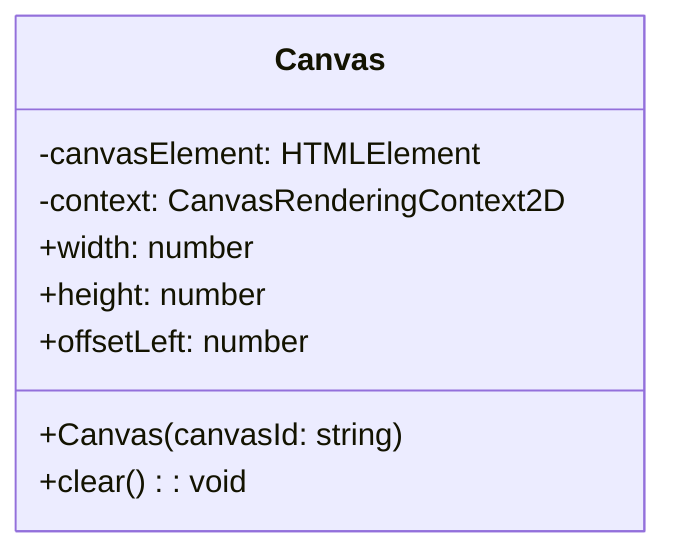
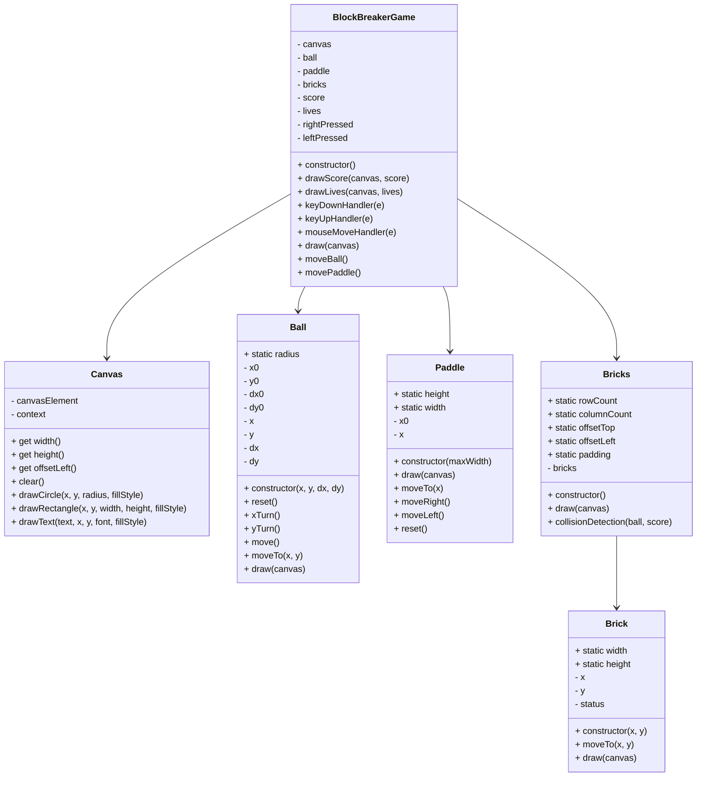

# FutOopSample.20221209

## OOP.Samples.JavaScript

### BlockBreaker.OOP.1.html

#### Class Diagram

```mermaid
classDiagram
    class Canvas {
        -canvasElement: HTMLElement
        -context: CanvasRenderingContext2D
        +Canvas(canvasId: string)
        +width: number
        +height: number
        +offsetLeft: number
        +clear(): void
    }
```

### BlockBreaker.OOP.5.html

#### Class Diagram

```mermaid
classDiagram
    class Canvas {
        - canvasElement
        - context
        + get width()
        + get height()
        + get offsetLeft()
        + clear()
        + drawCircle(x, y, radius, fillStyle)
        + drawRectangle(x, y, width, height, fillStyle)
        + drawText(text, x, y, font, fillStyle)
    }

    class Ball {
        + static radius
        - x0
        - y0
        - dx0
        - dy0
        - x
        - y
        - dx
        - dy
        + constructor(x, y, dx, dy)
        + reset()
        + xTurn()
        + yTurn()
        + move()
        + moveTo(x, y)
        + draw(canvas)
    }

    class Paddle {
        + static height
        + static width
        - x0
        - x
        + constructor(maxWidth)
        + draw(canvas)
        + moveTo(x)
        + moveRight()
        + moveLeft()
        + reset()
    }

    class Brick {
        + static width
        + static height
        - x
        - y
        - status
        + constructor(x, y)
        + moveTo(x, y)
        + draw(canvas)
    }

    class Bricks {
        + static rowCount
        + static columnCount
        + static offsetTop
        + static offsetLeft
        + static padding
        - bricks
        + constructor()
        + draw(canvas)
        + collisionDetection(ball, score)
    }

    class BlockBreakerGame {
        - canvas
        - ball
        - paddle
        - bricks
        - score
        - lives
        - rightPressed
        - leftPressed
        + constructor()
        + drawScore(canvas, score)
        + drawLives(canvas, lives)
        + keyDownHandler(e)
        + keyUpHandler(e)
        + mouseMoveHandler(e)
        + draw(canvas)
        + moveBall()
        + movePaddle()
    }

    BlockBreakerGame --> Canvas
    BlockBreakerGame --> Ball
    BlockBreakerGame --> Paddle
    BlockBreakerGame --> Bricks
    Bricks --> Brick
```
